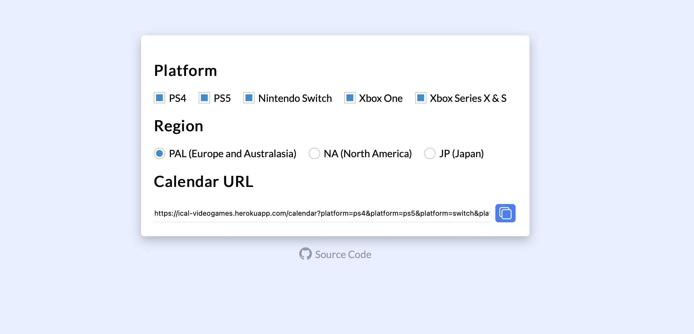
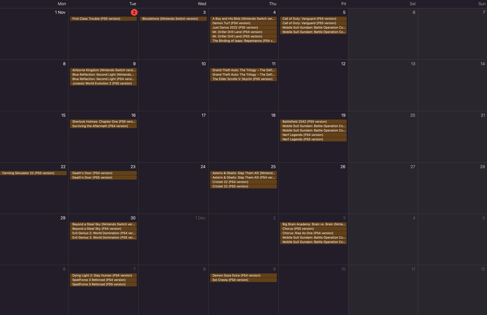

# iCal video games
Track upcoming video game release dates directly in your calendar.

## Installation
Build dockerfile
```console
$ docker build -t ical-videogames .
```
Run dockerfile
```console
$ docker run -d -p 5000:5000 ical-videogames
```

## Usage

1. Open [http://localhost:5000](http://localhost:5000)

2. Choose platforms/region and copy the URL.


3. Add URL to your calendar:


## Development
```console
$ flask run --reload --debug
```
